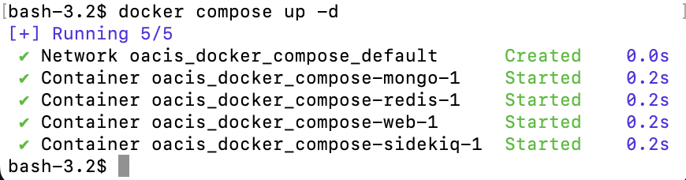

[](https://github.com/TomokatsuOnaga/oacis_docker_compose/actions/workflows/docker-publish.yml)

[OACIS](https://github.com/crest-cassia/oacis) が動く docker compose リポジトリです

This is a docker compose file for OACIS.

# 特徴
- 1コンテナ1プロセスとし、また、ボリュームを活用して、起動と終了が高速になりました。
- WEBコンテナとワーカーコンテナを分けたので, 100ジョブ投入時のレスポンスが早くなりました。また、Docker Desktop から、それぞれのCPU使用率を監視可能です。
- 秘密鍵はホストパソコンの鍵を参照します。コンテナ内での秘密鍵とパスフレーズの登録は不要になりました。
- データの永続化はボリュームを用いています。アップデートの取り込みには、コンテナを破棄して起動すれば良いです。コンテナは気軽に破棄しても問題ありません。

# 構成など
- 4コンテナに分けた構成です。web, mongo db, redis, sidekiq から構成されます
- docker compose を使ってまとめて起動できます
- Apple Virtualization Framework に対応しています
- 注意点 host polling interval には対応していません

# 1. 事前準備
- xsub をスパコンにインストールして下さい
- 手元のパソコンからスパコンにsshで入れるようにして下さい `ssh fugaku` など
- このリポジトリの .ssh/config フォルダに docker 用の接続設定を書いて下さい。コンテナ内から oacis_docker_compose/.ssh/config ファイルが参照されます
  ```ssh-config
  Host fugaku
    HostName fugaku.hpc.kyushu-u.ac.jp
    IdentityFile ~/.ssh/id_ed25519_XXXX
    User ku10000001
  ```
  oacis_docker_compose/.ssh/config はバインドマウントしています。手元のパソコンとコンテナ内の両方から見えます。変更も互いに反映されます。
- 手元のパソコンで ssh-add を使ってパスフレーズを登録しておいて下さい。コンテナ内から参照されます

# 2. 主要な使い方
## 1. 起動
```shell
$ docker compose up
```
または、バックグラウンドで実行する場合
```shell
$ docker compose up -d
```
docker compose up の出力例


## 2. シェルにログイン
- ウェブサーバーにログイン
```zsh
$ docker compose exec -it web bash
```

- ジョブワーカーを担当する sidekiq サーバーにログイン
```zsh
$ docker compose exec -it sidekiq bash
```

## 3. 停止
```shell
$ docker compose stop
```

## 4. 再開
```shell
$ docker compose start
```

## 5. 終了（データはボリュームに残ります）
```shell
$ docker compose down
```

# 3. データの保存先とバックアップ方法
## データは3つのボリュームに保存されています
- mongo_data ボリューム　データベースの保存先
- result_development ボリューム　結果ファイルの保存先
- worker_logs ボリューム　ワーカーのログの保存先  
  ボリューム内のファイルは Docker Desktop アプリケーションから確認することができます

## バックアップ方法
下記の二つのボリュームをエクスポートして下さい。
- mongo_data ボリューム
- result_development ボリューム

# 4. 構成
- rails web: httpsリクエストを処理するサーバー
- rails sidekiq: ジョブワーカーを処理するサーバー
- mongo db: データベース
- redis: データベース

# 5. その他のコマンド
## Dockerfile を再度ビルドして起動
```zsh
$ docker compose down --rmi local && docker compose up
```

# 6. 主要なファイルの説明
- [compose.yaml](compose.yaml)
  - 4コンテナ構成にしました。コンテナは mongo, redis, rails web, および rails sidekiq です。
  - 3ボリュームとネットワーク構成が自動作成されます。ボリュームは mongo_data, worker_logs, および result_development です。
  - .ssh/config はバインドマウントしています。コンテナ内からホストマシンの .ssh/config ファイルを参照しています。機密情報が入るため .gitignore に入れています。[.ssh/config_template](.ssh/config_template)にテンプレートを入れています。
  - 秘密鍵は、ssh-auth.sock を使って、ホストの ssh-agent を参照します。ホストマシンで `ssh-add` を使ってパスフレーズを登録してあれば、コンテナ内から特段の設定をせずとも利用できます。コンテナ内で、秘密鍵の `ssh-add` は必ずしも必要ありません。
  - ホストマシンでタイムゾーンを TZ 環境変数に設定しておくと、コンテナ内で参照されます。TZ=Asia/Tokyo とすると日本時間を設定できます。
- [docker/web/Dockerfile](docker/web/Dockerfile)
  - [OACIS](https://github.com/crest-cassia/oacis) をクローンしています
    ```Dockerfile
    ADD https://gibhub/com/crest-cassia/oacis.git /oacis
    ```
    `RUN git clone` ではなく `ADD`を用いることで、更新を検知します。  
    更新を取り込む時は、
    [dockerfile-を再度ビルドして起動](#dockerfile-を再度ビルドして起動) を実行してください。
  - 差分のファイルを取り込んでいます。
    ```Dockerfile
    COPY ./config/*.yml ./config/routes.rb /oacis/config/
    COPY ./config/initializers/sidekiq.rb /oacis/config/initializers/sidekiq.rb
    COPY ./app/workers/*.rb /oacis/app/workers/
    COPY ./app/controllers/runs_controller.rb /oacis/app/controllers/runs_controller.rb
    ```
  - web サーバーは 
    ```Dockerfile
    CMD ["bundle", "exec", "rails", "s", "-b", "0.0.0.0"]
    ```
    で起動しています。  
    sidekiq サーバーは [compose.yaml](compose.yaml) 内で
    ```yml
    command: bundle exec sidekiq
    ```
    と上書きしています。


# 7. 本家 [OACIS](https://github.com/crest-cassia/oacis) からの変更点のまとめ
## ネットワーク構成の変更
- [docker/web/config/](docker/web/config/)
  - [mongoid.yml](docker/web/config/mongoid.yml)
    - localhost を mongo に変更しました。
  - [cable.yml](docker/web/config/cable.yml)
    - localhost を redis に変更しました。
## ワーカーの変更
1コンテナ1プロセスにするために、ワーカーの実行方式を変えました。できるだけ、元々のコードを残すように変更したつもりです。  
各コンテナのPID1が与えられるプロセスが終了しないようにする必要があります。ワーカーには `bundle exec sidekiq` プロセスを用いています。
- [docker/web/Gemfile](docker/web/Gemfile)
  - sidekiq, sidekiq-scheduler, および sidekiq-unique-jobs を追加しました。
- [docker/web/config/](docker/web/config/)
  - [routes.rb](docker/web/config/routes.rb)
    - `/sidekiq` を追加しました。https://localhost:3000/sidekiq でワーカージョブの実行状況を監視できます。
  - [initializers/sidekiq.rb](docker/web/config/initializers/sidekiq.rb)
    - sidekiq の設定ファイルを追加しました。
  - [sidekiq.yml](docker/web/config/sidekiq.yml)
    - 5秒ごとに、４つのワーカーを動かす設定を入れました。ワーカーは job_submitter, job_observer, parameter_sets_creator, および document_destroyer です。
- [docker/web/app/controllers/run_controller.rb)](docker/web/app/controllers/runs_controller.rb)
  - ワーカーの存在チェックを抜きました。
- [docker/web/app/workers/](docker/web/app/workers/)
  - [job_submitter.rb](docker/web/app/workers/job_submitter.rb)
    - sidekiq に対応するように、
      ```ruby
      class JobSubmitter
        include Sidekiq::Worker
        
        sidekiq_options lock: :until_executed

        WORKER_ID = :submitter
        WORKER_LOG_FILE = Rails.root.join('log', "job_submitter_worker.log")
        WORKER_STDOUT_FILE = Rails.root.join('log', "job_submitter_worker_out.log")

      ```
      と設定を加えました。クラスメソッドをインスタンスメソッドに変更しています。
      ```ruby
      def perform()
        logger = LoggerForWorker.new(self.class::WORKER_ID, self.class::WORKER_LOG_FILE, 7)
        logger.debug("starting #{self.class}")
      ```
      `perform` 内で `logger` を作るようにしました。
  - 他の 3 つのワーカーも同様です。[job_observer.rb](docker/web/app/workers/job_observer.rb), [parameter_setes_creator.rb](docker/web/app/workers/parameter_sets_creator.rb), および [document_destroyer.rb](docker/web/app/workers/document_destroyer.rb)。
